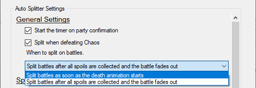

# Final Fantasy Pixel Remaster Auto Splitter

An auto splitter for Final Fantasy Pixel Remaster.

## Features

* ✅ Start timer on new game
* ✅ Splits at various moments in-game that are commonly split (see settings)
* ✅ Split on Chaos death animation
* ✅ Works with both, the Steam and the Windows Store version

## Usage

- Open LiveSplit, right click and select 'Edit Splits'


- In the splits editor, make sure that the game is 'Final Fantasy' so that LiveSplit can find the autosplitter.

- Click the 'Activate' button (this might take a few seconds to finish). If the button is not available, the game name is not correct.


- Once activated, open the 'Settings'


There are two settings which are enabled by default:

- Auto start when confirming the party selection
- Auto split on Chaos with the first flash of the death animation

In addition, the autosplitter can split during other scenarios as well.
Those are when certain battles are done, items picked up, or map locations change.

For battle related splits, you can also choose when to split, based an your preference:

- As soon as the death animation (the dissolve fadeout thing) starts
- After you went through all the spoils are loading back to where you've been before



Chaos will always be split according to the rules, regardless of this setting.

***

None of those additional settings are enabled by default, since they depend on each runners route an preference.
However, they do work for any category or route.
Go through the settings and select the settings that mirror the splits that you have and want to have splitted automatically.

Any other splits you have that are not covered by the autosplitter need to be split manually (the autosplitter doesn't know about them and will *not* skip them).
If you have a split you would like to have included in the autosplitter, find my on the FF1/2 Speedrunning discord and I can see if I can find a way to add the split (no guarantees).


You likely don't to enable all settings.
Especially for the beginning, a lot of them split around the same event with only few seconds in between.
For example, 'Astos' and 'Crystal Eye' could both be selected, but usually you only want to split on one of them, since you are getting the eye immediately after defeating Astos.

>[!note]
> The order of the settings is **not** important.
> That is, your route might go to the volcano before the fortress and your splits are in the order of 'Marilith' before 'Tiamat'.
> You can still select the 'Tiamat' and 'Marilith' settings and they will split correctly, even though the settings have them in the order of Tiamat first.

***

After confirming the settings, you're good to go.

***

## Manual installation

>[!IMPORTANT]
> Do not follow these instructions when you have done the steps above.
> Don't add an 'Auto Splitting Runtime' component when you have enabled the autospliiter in the splits.
> Having both splitters running will result in double splits or crashes.


* Go the latest release: https://github.com/knutwalker/ff1pr-autosplitter/releases/tag/latest
* Download the `ff1pr_autosplitter.wasm` file
* Add an 'Auto Splitting Runtime' component to you layout
* Open the settings of this configuration and point it to the downloaded file


***

# Developer section

## Build from source

This auto splitter is written in Rust. In order to compile it, you need to
install the Rust compiler: [Install Rust](https://www.rust-lang.org/tools/install).

Afterwards install the WebAssembly target:
```sh
rustup target add wasm32-unknown-unknown --toolchain stable
```

The auto splitter can now be compiled:
```sh
cargo b --release
```

The auto splitter is then available at:
```
target/wasm32-unknown-unknown/release/ff1pr_autosplitter.wasm
```

Make sure to look into the [API documentation](https://livesplit.org/asr/asr/) for the `asr` crate.

## Development

You can use the [debugger](https://github.com/LiveSplit/asr-debugger) while
developing the auto splitter to more easily see the log messages, statistics,
dump memory, step through the code and more.

The repository comes with preconfigured Visual Studio Code tasks. During
development it is recommended to use the `Debug Auto Splitter` launch action to
run the `asr-debugger`. You need to install the `CodeLLDB` extension to run it.

You can then use the `Build Auto Splitter (Debug)` task to manually build the
auto splitter. This will automatically hot reload the auto splitter in the
`asr-debugger`.

Alternatively you can install the [`cargo
watch`](https://github.com/watchexec/cargo-watch?tab=readme-ov-file#install)
subcommand and run the `Watch Auto Splitter` task for it to automatically build
when you save your changes.

The debugger is able to step through the code. You can set breakpoints in VSCode
and it should stop there when the breakpoint is hit. Inspecting variables may
not work all the time.
